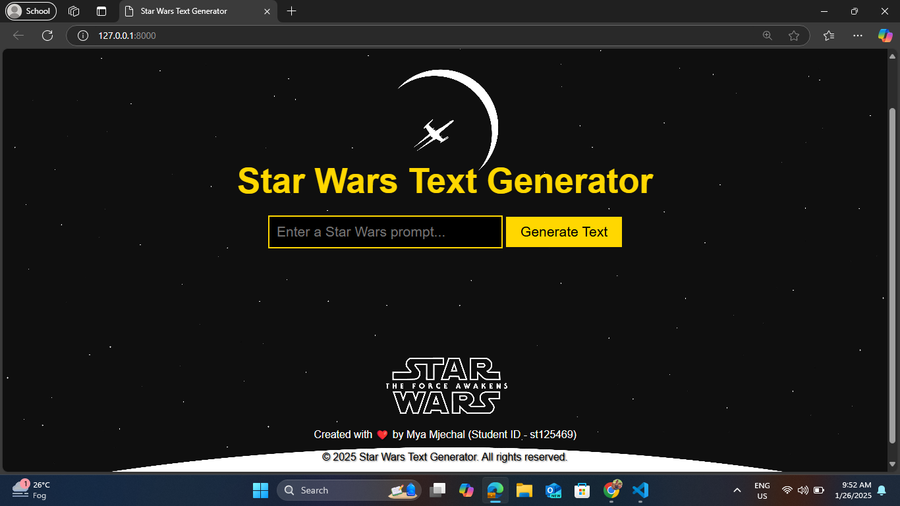
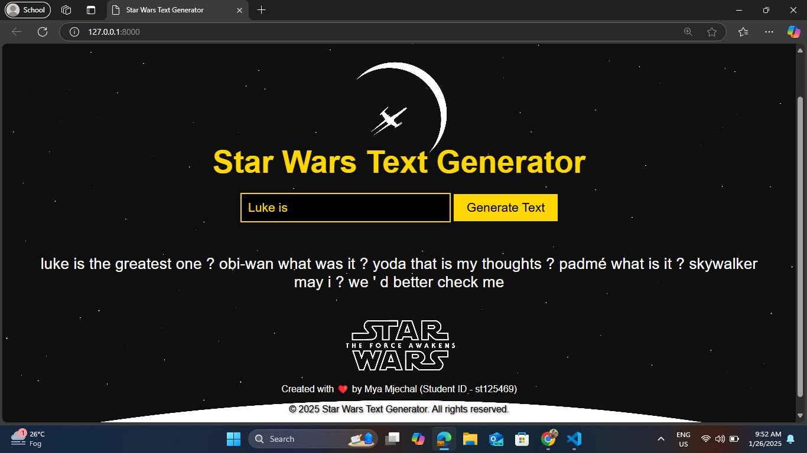

# NLP Assignment 2 (Language Model)
## Table of Contents
- [Student Information](#student-information)
- [System Overview](#system-overview)
    - [Workflow](#workflow)
    - [Implementation](#implementation)
- [Tasks](#tasks)
    - [Task 1: Dataset Acquisition](#task-1-dataset-acquisition)
    - [Task 2: Model Training](#task-2-model-training)
    - [Task 3: Text Generation - Web Application Development](#task-3-text-generation---web-application-development)
- [Installation Setup](#installation-setup)
- [Usage](#usage)
- [Screenshots of Website Working](#screenshots-of-website-working)
- [Result](#result)

## Student Information
- **Name:** Mya Mjechal
- **Student ID:** st125469
- **Major:** AIT - Data Science and Artificial Intelligence (DSAI)
- **Course:** AT82.05: Artificial Intelligence: Natural Language Understanding
- **Assignment:** NLP A2

## System Overview
This project is based on the class assignment detailed in the [`A2_Language_Model.pdf`](https://github.com/MyaMjechal/nlp-a2-language-model/blob/main/A2_Language_Model.pdf) from AIT. The assignment involves training a language model using a text dataset and demonstrating its capabilities through a web application for text generation.

### Workflow
- **Input:** The user provides a text prompt.
- **Processing:** The trained language model generates a continuation based on the prompt.
- **Results:** The output text is displayed to the user.

### Implementation
- **Backend:** Flask is used for handling model execution and user requests.
- **Frontend:** A simple, responsive interface built using HTML, CSS, and JavaScript.
- **Models:** A language model trained on the selected dataset using an LSTM-based architecture.

## Tasks
### Task 1: Dataset Acquisition
The dataset chosen for this project is the Star Wars Scripts Database available on Kaggle. This dataset contains transcripts from the Star Wars movie series, which is a text-rich source suitable for language modeling.

**Title:** Star Wars Scripts Database
**Creator:** Oscar Yezfeijo
**Source:** [`Kaggle - Star Wars Scripts Database`](https://www.kaggle.com/datasets/oscaryezfeijo/star-wars-scripts-database)
**License:** Open Database (ODbL) for the database, Database Contents under Database Contents License. Check [`Kaggle Licensing Information`](https://opendatacommons.org/licenses/dbcl/1-0/) for details.

### Task 2: Model Training

1. **Preprocessing the Text Data**

The dataset was preprocessed using the following steps:
- **Data Collection:** 10 text files from Kaggle were collected.
- **Special Character Removal:** Non-text characters were removed.
- **Line Separation:** Text was separated line by line.
- **CSV Conversion:** The cleaned text was converted into a single CSV file using `preprocess_dataset.py`.
- **Data Splitting:** The dataset was split into training, validation, and test sets using `split_star_wars_dataset.ipynb` and uploaded to Hugging Face.

2. **Model Architecture and Training Process**

The language model is built using a Recurrent Neural Network (RNN) architecture with Long Short-Term Memory (LSTM) layers. The architecture includes:

- **Embedding Layer:** Converts word indices to word embeddings.
- **LSTM Layers:** Processes sequential data with multiple LSTM layers.
- **Dropout Layer:** Applied after embedding and LSTM layers to prevent overfitting.
- **Linear Layer:** Predicts the next word using hidden states from the LSTM.

**Training Process:**

- **Optimizer:** Adam optimizer with a specified learning rate.
- **Loss Function:** Categorical cross-entropy loss.
- **Hyperparameters:** Includes vocabulary size, embedding dimension, hidden dimension, number of LSTM layers, dropout rate, and learning rate.

The model is trained to minimize the loss function and improve text generation capabilities.

### Task 3: Text Generation - Web Application Development

1. **Input Box**

The web application includes an input box where users can type in a text prompt.

2. **Text Generation**

The Flask backend processes the input prompt using the trained language model and generates a continuation of the text.

3. **Web Application Interaction with Language Model**

- **Frontend (HTML/JS):** The user enters a text prompt into an input field, which is sent to the backend via a JavaScript POST request.
- **Backend (Flask):** The Flask server processes the input using the loaded language model and generates the continuation.
- **Frontend (HTML/JS):** The generated text is sent back to the frontend and displayed to the user.

## Installation Setup
To set up the project locally, follow these steps:
1. Clone the repository:
    ```bash
    git clone https://github.com/MyaMjechal/nlp-a2-language-model.git
    ```
2. Navigate to the project directory:
    ```bash
    cd nlp-a2-language-model/app/code
    ```
3. Install the required dependencies:
    ```bash
    pip install -r requirements.txt
    ```
4. Run the application:
    ```bash
    python app.py
    ```

## Usage
Once the Python application is running, you can access the text generation web application by opening your browser and navigating to http://localhost:8000. From there:
1. Input a text prompt into the input box (e.g., "Luke is").
2. The web application will use the trained language model to generate and display a continuation of the input text.

## Screenshots of Website Working

_Figure 1: Initial page of the Star Wars text generator website_


_Figure 2: Result of Star Wars story line generation with initial phrase 'Luke is'_

## Result
Training perplexity - 40.594
Validation perplexity - 77.044
Testing perplexity - 77.599
